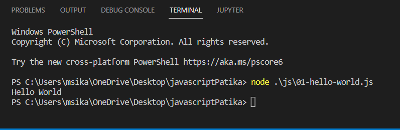

# Javascript

## NodeJS Nedir?

- Node.js, açık kaynaklı, genelde sunucu tarafında çalışan ve ağ bağlantılı uygulamalar için geliştirilmiş bir çalıştırma ortamıdır.
- NodeJS kurulumu için : [https://nodejs.org/en/download/](https://nodejs.org/en/download/)
- NodeJS versiyon kontrolü için cmd de → node —version komutunu çalıştırmamız gerekir.

## **JavaScript Nedir?**

JavaScript, kısaltılmış haliyle JS,minimum maliyetle maksimum verim alınmasına yönelik programlama (tasarım) konseptidir.

### **JavaScript ile Java farklı dillerdir.**

JavaScript ve Java arasında; isimleri, yazım şekli ve standart kütüphanelerindeki benzerlikler dışında bir bağlantı yoktur ve iki dilin semantikleri çok farklıdır.


## **HTML, CSS ve JavaScript (Web'in temel taşları)**

HTML ve CSS ile JavaScript, World Wide Web'in (kısaca WWW veya Web) **temel üç öğesinden** biridir. Yaygın olarak web tarayıcılarında kullanılmakta olan JavaScript ile yazılan istemci tarafı betikler sayesinde tarayıcının kullanıcıyla etkileşimde bulunması, tarayıcının kontrol edilmesi, asenkron bir şekilde sunucu ile iletişime geçilmesi ve web sayfası içeriğinin değiştirilmesi gibi işlevler sağlanır.

Aşağıda yer alan görseldeki gibi HTML bir web sitesinin iskeletini yani ana yapısını oluşturmakta, CSS bu ana yapıya görsellik ve şekil vermekte, JavaScript ise yapının fonksiyonel olarak çalışmasını sağlamaktadır.


## **JavaScript'in Kullanılabileceği Alanlar**

- Front-end
- Back-end
- Mobil (Mobile)
- Masaüstü (Desktop)
- Oyun (Game)
- Makine Öğrenmesi, Derin Öğrenme ve Yapay Zeka (Machine Learning, Deep Learning & Artificial Intelligence)

## Merhaba Dünya

```csharp
console.log("Merhaba Dünya")
alert("Merhaba Dünya") // Sitede uyarı penceresi olarak göstermek için
document.write("Merhaba Dünya") // Dokümana yazdırmak için
```

console.log kullanımı : 



## Değişken Tanımlama

- Değişkenler, girdiğimiz verileri, bilgileri tutar. Değişken isimlendirmede dikkat etmemiz gerekenler şunlardır.
    - Değişken isimleri harf, _ veya $ işareti ile başlayabilir.
    - İlk harften sonra değişken isimlerinde rakamlar da kullanılabilir. $ ve _ dışında başka noktalama işaretleri kullanılamaz.
    - Değişken ismindeki harfler arasında boşluk kullanılamaz.
- JavaScript loosely typed bir programlama dilidir. Yani bir değişkeni tanımlarken değişkenin türünü (sayısal, metinsel, boolean) belirtmemize gerek yoktur.

### var

- Değişken değerleri değiştirilebilir.
- Aynı isimle tekrardan tanımlanabilirler.
- var ile tanımlanan değişkenler global scope veya function scope'tur. Global scope'ta tanımlanan değişkenlere her yerden ulaşılabilir. Function içerisinde tanımlanan değişkenlere ise tanımlı olduğu fonksiyonda ulaşılabilir.

```jsx
// var ile değişken tanımlamak
var serverName = "zehracakir";
console.log(serverName);
```

### let

- Değişken değerleri değiştirilebilir.
- Aynı isimle tekrardan aynı blokta tanımlanamaz. Farklı block'larda aynı isimle tanımlanabilir.

```jsx
// let ile değişken tanımlamak
let serverName;
console.log(serverName);

// let ile değişkene bilgi atamak
serverName = "https://github.com/zehracakir";
console.log(serverName);

//let ile değişkene bilgi atayarak tanımlamak
let password = "1234";
console.log(password);

// değişken ataması yapmadan önce kullanmaya çalışmak
/* console.log(fullName);
 let fullName = "Zehra Çakır";
--> yukarıdaki kullanımda hata alırız. 
Değişkeni tanımlamadan ekrana bastırmaya çalıştık.
Bunu var ile tanımlasak hatayı göremezdik sadece undefined derdi.*/

let fullName = "Zehra Çakır";
console.log(fullName);

// let kullandığımızda hataları daha net şekilde görebiliyoruz. var da böyle bir imkanımız olmuyor.

//let ile tanımlanan değişkenin içindeki bilgiyi değiştirmek
fullName = "Lorem Ipsum";
console.log(fullName);
// let ile tanımlanan değişkenlerin içlerindeki bilgiler birden fazla kez değiştirilebilir

// let ile birleştirme veya ekleme işlemi
fullName = "Zehra"; + fullName
console.log(fullName);
console.log(fullName + " Deneme");
fullName += " Yeni Eklenen Bilgiler";
console.log(fullName);

fullName = "Sıfırlandı";
fullName += " ve yeni fullName";
console.log(fullName);
```

### const

- const ile tanımlanan objelerin özellikleri (properties) değiştirilebilir fakat objenin kendisi değiştirilemez. Diziler içinde aynısı geçerlidir. Dizi değerleri değiştirilebilir fakat dizinin kendisi değiştirilemez.

```jsx
// const ile değişkeni boş tanımlamaya çalışmak
const serverPassword = ""; // içi boş bir değişken tanımladım
console.log(serverPassword);
const  SERVER_PASSWORD = "sdü";
console.log(SERVER_PASSWORD); 
// SERVER_PASSWORD = "1234"; 
// Bu kısımda hata alırız. Çünkü const ile tanımlanan değişkenlerin içerikleri daha sonradan DEĞİŞTİRİLEMEZ. Değiştirilebilecek bir değişken istersek bunu let ile tanımlayabiliriz.
```

## Number Veri Türü Kullanımı

JavaScript dili weakly-typed yani güçsüz türlü bir dildir. Değişkenlerin ve parametrelerin türlerini bildirmek gerekmez. Tür kullanımdan dolaylı olarak çıkartılır.

- Number veri türü tanımlamak :

```jsx
// number veri türü tanımlamak
let price = 100;
let tax = 0.18;
let priceTax = price * tax;
let total = price + priceTax;
console.log("fiyat :",price,
            "kdv oranı : ",tax,
            "kdv tutarı: ",priceTax,
            "Toplam Fiyat",total);
```

- Aritmetik işlemler yapmak :

```jsx
// toplama işlemi
let counter = 320;
counter = counter + 1; // uzun yöntem
console.log(counter);

counter +=1;
console.log(counter); // kısa yöntem

counter++;
console.log(counter); // en kısa yöntem

// çıkarma işlemi
counter--; // 1 azaltma
console.log(counter);
counter -=1; // 1 azaltma
console.log(counter);

// çarpma işlemi
counter *=10; 
console.log(counter);

// bölme işlemi
counter /=10; 
console.log(counter);

// işlem önceliği
console.log(2 + 3 * 10); // 32
console.log((2 + 3) * 10); // 50

// mod(kalan) alma %
// Örnekler üzerinden gidelim 
// 1-) sayı tek mi çift mi --> 0 ise çift, 1 ise tek
console.log(3 % 2); // kalan 1 olur
console.log(14 % 2); // kalan 0 olur

// 2-) 8 ürün alan koliye tüm ürünler sığıyor mu ?
console.log("kalan ürün sayısı :",18 % 8);

// üs alma **
console.log("normal çarpma ile",2 * 2 * 2 * 2);
console.log("üs alma ile",2 ** 4);

// aşağı yuvarlama işlemi --> Math.floor()
console.log("aşağı yuvarlama sonucu:",Math.floor(1.9)); // 1

// // yukarı yuvarlama işlemi --> Math.ceil()
console.log("yukarı yuvarlama sonucu:",Math.ceil(1.9)); // 2

// yakına yuvarlama işlemi --> Math.round()
console.log("yakına yuvarlama sonucu:",Math.round(1.5)); // 2
console.log("yakına yuvarlama sonucu:",Math.round(1.4)); // 1
```

- String i number a dönüştürme

```jsx
let stringNumber = "11";
console.log(stringNumber);
let newNumber = Number(stringNumber);
console.log(newNumber); // türü değişti
```

## **Boolean Veri Türü Kullanımı**

Boolean veri tipleri sadece iki değerden birini ifade eder. Bunlar true ya da false'dur.

- 0 ve 1 i anlamak

```jsx
let isActive = false; // 0
isActive = true; // 1
console.log(isActive); // true
```

- True ve false’u neye göre döndürür

```jsx
let userName;
let isUserName = Boolean(userName); // false 
console.log(isUserName); // false döndü
console.log(Boolean("11")); // true
console.log(Boolean("")); // false
/*
 Boolean içi boş olursa false, dolu olursa true döndürür.
*/
userName = "user";
console.log("User Name :",Boolean(userName)); //true

// 0 ve -0 da Boolean false döndürür.
console.log(Boolean(0)); // false 
console.log(Boolean(-0)); // false
console.log(Boolean(-0.1)); // true

console.log(Boolean(5 == 5)); // 5, 5 e eşit mi --> true
console.log(Boolean(5 == 10)); // 5, 10 a eşit mi --> false
```

- Karar yapılarında boolean kullanırız.

```jsx
console.log("büyük mü",Boolean(userName.length > 0)); // true
```

### **Boolean Veri Türü JavaScript'te Neyi İfade Eder?**

JavaScript'te boolean veri türü, primitive yani ilkel veri tiplerinden bir tanesidir. Mantık olarak diğer dillerle tamamen aynıdır. If-else, switch, while gibi koşullu ifadelerle birlikte oldukça sık bir şekilde kullanılır. Boolean veri türü Mozilla Firefox, Google Chrome, Safari, Opera ve Internet Explorer tarafından desteklenmektedir.

### **Değişken Türünü Kontrol Etmek ve Değişken Türünü Değiştirmek**

- typeof() ile verilerimizin türlerini kontrol edebiliriz.

```jsx
// veri turunu ogrenmek "typeof",
let price = 111;
let stringPrice = "111";
let hasPassword = true;

console.log(
    "price :",typeof(price)
)
console.log(
    "stringPrice :",typeof(stringPrice)
)
console.log(
    "hasPassword :",typeof(hasPassword)
)
```

- typeof() u Console da da kullanabiliriz.


- === ifadesiyle typeof() içinde verilen veriyle türlerinin aynı olup olmadığını kontrol edebiliriz.


- Bir başka şekilde isInteger(), isFinite() veya isNaN() kullanarak da kontrol sağlayabiliriz.

```jsx
//isInteger( ) yöntemi, sayıların tam sayı olup olmadığını belirler.
Number.isInteger(123) //true
Number.isInteger(-123) //true
Number.isInteger(0.5) //false

//isFinite () yöntemi, bir değerin sonlu bir sayı olup olmadığını belirler.
Number.isFinite(0) //true
Number.isFinite('123') //false
Number.isFinite('Hello') //false
Number.isFinite(-Infinity) //false
Number.isFinite(0 / 0) //false

// Number.isNaN () yöntemi, bir değerin NaN (Not-A-Number) olup olmadığını belirler.
Number.isNaN(123) //false
Number.isNaN(0) //false
Number.isNaN('123') //false
Number.isNaN('Hello') //false
Number.isNaN('') //false
Number.isNaN(true) //false
Number.isNaN(undefined) //false
Number.isNaN('NaN') //false
Number.isNaN(NaN) //true
```

### **Değişken Türünü Değiştirmek**

- String ifadeleri int ve float a dönüştürmek :

```jsx
// string(metinsel) bilgileri int ve float a donusturmek
let number1 = "11";
number1 = parseInt(number1)
console.log(
    "number1 :",parseInt(number1),typeof(number1)
)

let number2 = "11px";
number2 = parseInt(number2)
console.log(
    "number2 :",parseInt(number2),typeof(number2)
)
```

—> ekran çıktımız


- Burada çevrim yapamaz. Başında string bir ifade bulunmasından dolayı.

```jsx
let number3 = "px11px";
number3 = parseInt(number3)
console.log(
    "number3 :",parseInt(number3),typeof(number3)
)
```

—> ekran çıktımız


```jsx
let number4 = "11px";
number4 = Number(number4)
console.log(
    "number4 :",number4,typeof(number4)
) // number4 : NaN number
// Number; sadece sayı varsa çevrim yapabilir. Başka herhangi bir karakter varsa çevrim yapamaz.
let number5 = "11";
number5 = Number(number5)
console.log(
    "number5 :",number5,typeof(number5)
) // number5 : 11 number

let number6 = "11.4px";
number6 = parseFloat(number6)
console.log(
    "number6 :",number6,typeof(number6)
) // number6 : 11.4 number
```

- Number’dan stringe dönüşüm

```jsx
// number veri tipinden string e donusturmek
let number7 = 55;
number7.toString()
console.log(typeof(number7)); // number 
number7 = number1.toString(); // number --> string
console.log(typeof(number7)); // string
```

## **Template Literals Kullanımı**

- Template literals, birden fazla satır yazabilme imkanı tanıyan ve kod okunabilirliğimizi artıran bir yapıdır.

```jsx
let username= "zehracakir";
const DOMAIN = "github.com"

// stringleri birleştirme
let email = username +"@"+DOMAIN
console.log("Merhaba",username,"sitemize hoşgeldin","mail adresin:",email);

// let info = `Merhaba username` // istedigimiz gibi değil çıktısı -> Merhaba username
// console.log(info)

// template literals ile 
let info = `Merhaba ${username} sitemize hoşgeldin.
Mail adresin: ${email} 
kisa isminiz: ${username[0]}.
mail adresinin uzunluğu: ${email.length}
borcunuz: ${(2+3)*10} TL
gunun saat bilgisi: ${new Date().getHours()}`
console.log(info) /* Merhaba zehracakir sitemize hoşgeldin.
                     Mail adresin: zehracakir@github.com 
                     kisa isminiz: z.
                     mail adresinin uzunluğu: 21
                     borcunuz: 50 TL
                     gunun saat bilgisi: 23*/
```

### Kısaca

- Kod okunabilirliğini kolaylaştırır
- Stringler içerisinde değişken yazma kolaylığını sağlar
- Şablon etiketlerini daha az karmaşık hale getirir

## **String Veri Türü İşlemleri**

JavaScript metinlerin tümü “string” veri tipi içinde tutulur ve string veri türü ile ilgili yapabileceğimiz birden fazla işlem vardır.

1. String veri tipinde bulunan bir ifadenin ne kadar uzun olduğunu bulmak için length özelliğimizi kullanırız.

```jsx
let email = "zehracakir@gmail.com";
let firstName = "Zehra";
let lastName = "Çakır";

// string karakter sayısı --> length
console.log(email.length); // 20
```

1. Metnin içinde aramayı indexOf() ile yaparız.  Aramak istediğimiz değerin index numarasını bize verir.

```jsx
console.log(DOMAIN.indexOf(".")); // . nın nerde olduğunu bulduk --> 5.indexteymiş
console.log(DOMAIN.slice(0,DOMAIN.indexOf("."))); // sadece gmail kısmını aldık
```

1. search(), indexOf() ile aynı sonuçlara ulaşırız genel olarak "***Regular Expressions***" işlemleri için çok kullanılan bir metottur.

```jsx
// String içinde istediğimiz bilgiyi aramak ve yerini bulmak --> search
console.log(email.search("@")); // 10
console.log(email[10]); // @
// Eğer olmayan bir şeyi arıyorsak bize -1 döndürür.
console.log(email.search("github.com")); // emailde github.com olmadığından -1 döner.
```

1. Metin içinden almak istediğimiz yerleri slice() ile alırız. Index numaralarını vererek metin içinde bulunan parçayı alabiliriz.

```jsx
// string içerisinden belli bir aralığı almak 
console.log(email.slice(0,10)); // zehracakir
// domain bilgisi almak
let DOMAIN = email.slice(email.search("@")+1); // almak istediğimiz yeri alırken +1 diyip almalıyız. Çünkü son elemanı dahil etmiyor.
console.log(DOMAIN); // gmail.com
```

1. replace() ile aranan metni istediğimiz metin ile değiştiririz.

```jsx
// bilgiyi değiştir --> replace 
email = email.replace('gmail.com','github.com');
console.log(email);
```

1. concat() ile elimizde bulunan iki string türündeki veriyi birleştiririz.

```jsx
// string birleştirme
 let firstName1="Zehra";
 let lastName1="Çakır";
 console.log(firstName1.concat(" ",lastName1)); // Zehra Çakır
```

1. charAt() ile belirtilen index numarasında yer alan karakteri buluruz.

```jsx
console.log(firstName.charAt(0)); // Z
// Burada ilk karakteri bulduk.
```

1. charCodeAt() ile belirtilen index numarasında yer alan karakterin Unicode değerini buluruz.

```jsx
var name1= "Zehra Çakır";
 console.log(name1.charCodeAt(1)); // 101
```

9.  split() ile istenilen metin diziye çevirebiliriz. Kullanılan parametre ile metnin nasıl parçalanacağı belirtiriz.

```jsx
var name2= "Zehra,Çakır";
console.log(name2.split(",")); // ['Zehra', 'Çakır']
```

1. String bir ifadenin içerisinde, aradığımız karakterin yerini bulmak için [ ] de kullanabiliriz.

```jsx
console.log(firstName[0]); // Z
```

1. String bir ifadeyi tamamen büyük veya küçük harf yapmak istiyorsak. Büyük harf için toUpperCase(), küçük harf için ise toLowerCase() metotlarını kullanırız.

```jsx
// buyuk harf - kucuk harf  donusumleri
firstName=firstName.toUpperCase(); // hepsini büyük harfe çevirdik
console.log(firstName); // ZEHRA

firstName=firstName.toLowerCase(); // hepsini küçük harfe çevirdik
console.log(firstName); // zehra
```

1. İlk harfi büyük diğerlerini küçük yapmak.

```jsx
let fullName = `${firstName[0].toUpperCase()}${firstName}`; // Zzehra --> olmadı 
console.log(fullName);
let fullName1 = `${firstName[0].toUpperCase()}${firstName.slice(1)}`; // Zehra 
console.log(fullName1);
```

1. Aldığımız veri istediğimiz bilgiyle başladı mı? Veya istediğimiz bilgiyle bitti mi? Bu durumu kontrol etmek için startsWidth() ve endsWidth() metodunu kullanırız.

```jsx
console.log(email.startsWith("zehra")); // true
console.log(email.endsWith("@")); // false
```

## **Document Object Model (DOM) Nedir?**

 **Document Object Model**, programların ve komut dosyalarının bir belgenin içeriğine, yapısına ve stiline dinamik olarak erişmesine ve güncellemesine izin veren bir platform ve dilden bağımsız bir arayüzdür.

Bir HTML belgesini iç içe geçmiş kutular olarak hayal edebilirsiniz. <body> ve </body> gibi çevreleyen etiketler, sırayla başka etiketler veya metinler içeren diğer etiketleri kapsar.

Tarayıcının belgeyi temsil etmek için kullandığı veri yapısı bu şekli izler. Her kutu için, hangi HTML etiketini temsil ettiği ve hangi kutuları ve metni içerdiği gibi şeyleri bulmak için etkileşime girebileceğimiz bir nesne vardır. Bu temsil, **Document Object Model** veya kısaca **DOM** olarak adlandırılır.

DOM’da HTML ile hazırladığınız sayfa, ”document”; bu document'in içine yerleştirdiğiniz her türlü öğe ise ”element” olarak adlandırılır. DOM'da nesnelerin birer element olarak kullanılabilmesi için hiyerarşik bir düzen izlenerek çağrılmaları gerekir. HTML’deki her bir elamanın birbiri ile hiyerarşik bir yapı oluşturması ile oluşur. DOM bir ağaç dizini gibi bütün dokümanları birbirine bağlar.


- DOM ile yapabileceğimiz işlemlere birkaç örnek kod

```jsx
console.log(document.URL); // http://127.0.0.1:5500/index.html
console.log(document.location); // host, hostname vs şeylere ulaşırız.
console.log(document.location.hostname); // 127.0.0.1
console.log(document.location.pathname);  // /index.html
console.log(document.body); // dokumanin body kısmına ulaşırız
console.log(document.head); // dokumanin head kısmına ulaşırız
console.log(document.baseURI); // http://127.0.0.1:5500/index.html
```

- Ayrıca !

```jsx
document.body.style.backgroundColor = "aqua"; // document üzerinden body nin arka plan rengini aqua olarak değiştirdik
```

! Arkaplan rengi değiştirme vs gibi işlemleri CSS ile de yapabiliriz fakat Javascript bize dinamiklik sağlar.

- **Dosya oluşturmak, elementleri ve içeriklerini silme/ekleme gibi fonsiyonları vardır.**

```jsx
<html><head><titte>Form</titte><script type="text/javascript">document.formAdi.isim.value = 'Baran Balin';
           document.getElementbyId('yas').value = '25';
       </script></head><body><form name="formAdi" method="post" action=""><input type="text" name="isim"><input type="text" id="yas"></form></body>
</html>
```

HTML içerisine yerleştirilmiş öğeleri çağırmak için, içinde bulunduğu diğer öğelerin çağrılması bir yöntem iken, bir öğeye bir id vererek bu id üzerinden çağırmak da bir başka yöntemdir.

Javascript kodumuzun ilk satırında metin kutusunun değeri hiyerarşik olarak çağırılmış ve değiştirilmiştir**.** İkinci satırda ise hiyerarşik yapı daha az önemsenerek Javascript içindeki DOM’un temellerinden olan ”getELementbyId” metodu kullanılmıştır.

### **DOM içerisinden Etiket ve ID ile Öğe Seçimi**

Document Object Model'de öğeler birden fazla yöntem ile seçilebilir.

1. getElementById ile

```jsx
<ul id="list">
        <li>
            <a href="#">Link Bilgisi</a>
        </li>
    </ul>
```

Yukarıda verilen Link Bilgisini getElementById ile seçelim:

```jsx
//innerHTML ile içerisinde yazan bilgiye ulaşırız. 
//getElementBYId ile öge secimi
let title=document.getElementById('title')
//console.log(title.innerHTML="Deneme") //hem eşitleme hem de yazdırma işlemi yapar, çok iyi bir kullanım değil
title.innerHTML="Degisen bilgi" //içerisindeki bilgiyi değiştirdik
console.log(title.innerHTML) //değişen bilgiyi ekrana yazdırdık
```

1. getElementsBytTagName ile

Elemanları etiket isimlerine göre seçmek için getElementsByTagName() metodu kullanılır. Birden çok elemente ulaşmak amacı ile kullanılır. Girdi olarak bir html elementi alır ve buna uygun bir HTMLCollection döndürür.

```jsx
<h2 id="title">Merhaba Dünya</h2>
```

Yukarıda verilen Merhaba Dünya bilgisini getElementsByTagName ile seçelim:

```jsx
let h2=document.getElementsByTagName('h2')  //çok efektif bir çözüm olmadı
```

getElementsByTagName ile sayfadaki tüm etiketleri de getirebiliriz:

```jsx
document.getElementsByTagName('*')
// Çıktı: HTMLCollection(33) [html, head, meta, link#.....
```

1. getElementsByName ile

Elemanları isimlerine göre getirmek için getElementsByName() metodu kullanılır. Elemanların name değerlerine göre bir Nodelist objesi döndürür.

```jsx
<input type="text" name="e-posta">
<input type="tel" name="telefon">
<input type="date" name="tarih">
```

Yukarıda verilen e-posta bilgisini getElementsByName ile seçelim:

```jsx
const emails = document.getElementsByName('e-posta');
// Çıktı: NodeList [input]
```

1. querySelector ile

querySelector() yöntemi, CSS seçicilere dayalı olarak DOM'dan html elemanlarını seçmenize izin veren iki modern JavaScript yönteminden biridir. Bu yöntem ile hem css class'larını hem de id'lerini kullanabilirsiniz. Bunu yaparken class için ön ek olarak nokta **"."**, id'ler için kare **"#"** kullanmanız gerekir. Sayfada eşleşen ilk elemanı size döndürecektir. Belirtilen elemanın eşleşememesi durumunda geriye null dönecektir.

```jsx
<ul id="list">
        <li>
            <a href="#">Link Bilgisi</a>
        </li>
    </ul>
```

Yukarıda verilen Link Bilgisini querySelector ile seçelim:

```jsx
//querySelector ile öge secimi
let link=document.querySelector("ul#list>li>a") //querySelector bir tane eleman seçebilir.querySelectorAll hepsini seçer.
// console.log(link.innerHTML)
// link.innerHTML="Yeni link bilgisi"

link.innerHTML+=" eklenen bilgi" //var olan link içerisindeki bilgiye ekleme yapar

link.style.color="red" //renk bilgisi eklemek
link.classList.add('btn') //class eklemek
```

1. querySelectorAll ile

querySelectorAll() metodu, querySelector() metodu ile aynı mantık ile çalışır tek farkı eşleşen ilk elamanı döndürmek yerine eşleşen tüm elemanları bir NodeList objesi olarak döndürmesidir.

```jsx
const elems = document.querySelectorAll('.bird, .animal');
console.log(elems.length); // 4
```

Öğrendiğimiz bu 5  metodu birlikte kullanabiliriz.Önce tek bir elemanı seçerek ardından içinde ikinci bir sorguyu yapabiliyoruz.

### **Prompt ile Kullanıcıdan Nasıl Bilgi Alınır?**

Prompt() kullanıcıya soru sorup klavyeden girilen bilgiyle işlem yapan, o bilgiyi döndüren bir window metodudur. alert() gibi Html üzerinde, HTML sayfasından bağımsız çalışır ve karşımıza diyalog penceresi şeklinde çıkar.

```jsx
let fullName=prompt("lütfen adınızı giriniz: ")
console.log(fullName) //kullanıcıdan adını aldık ve bunu console da görüntüledik
```

Kullanıcının da görmesini istersek

```jsx
<h1 id="greeting">Front-End</h1>
//id ekledik
```

```jsx
let fullName=prompt("lütfen adınızı giriniz: ")
let greeting=document.querySelector("#greeting") //kullanıcı da bunu görsün istiyorsak
greeting.innerHTML=`${greeting.innerHTML} <small style="color:red">${fullName}</small>
```

- Ekran Görüntüsü:


- Prompt mantığı: Kullanıcı **Tamam** düğmesini tıkladığında, giriş alanına girilen metin döndürülür. Kullanıcı herhangi bir metin girmeden Tamam'ı tıklarsa, boş bir dize döndürülür. Kullanıcı **İptal**
 düğmesini tıklarsa, bu işlev boş döndürür.

### **Liste İçerisindeki Öğeye Erişmek ve Yeni Öğe Eklemek**

JavaScript’de çoğu zaman HTML elementlerine JavaScript ile müdahale ederiz. Bazen doğrudan bir elemente ulaşmaya çalışıyorken bazen spesifik bir liste öğesine ulaşmamız gerekebilir.

Listemiz: 

```jsx
<ul class="sinif" id="list">
        <li>Zehra</li>
        <li>Bilgisayar</li>
        <li>Kod</li>
    </ul>
```

- **Öğelere Erişim Yöntemleri**
    - Kimlik (id) ile öğeye ulaşmak
    - Sınıf (class) ile öğelere/öğeye ulaşmak.
    - Etiket adı ile öğelere ulaşmak.
- getElementById ile

```jsx
let item = document.getElementById("list");
```

Yukarıda önce bir değişken tanımlayıp sonrasında ise list id değerine sahip elementi seçtik.Sayfamızda eğer ki bu id’ye sahip bir element var ise bize o elementi döndürür.

- getElementsByClassName ile

```jsx
let item2 = document.getElementsByClassName("sinif");
```

Burada ise item isminde bir değişken tanımlayıp sinif sınıfına sahip olan tüm öğeleri alıyoruz. Burada önemli nokta ise getElementsByClassName i bize class’a sahip tüm öğeleri nodeList olarak döndürür.

- Seçtiğimiz sınıfa müdahale edelim.
    
    item2 olarak tanımladığımız değişkenimizin içerisinde döngü yardımı ile dönelim ve sinif
     sınıfına sahip olarak öğelerin renklerini değiştirelim. Döngü kullanmamızın bir sebebi de getElementsByClassName metodunun bize nodeList dönüyor olması.
    
    ```jsx
    for (var i = 0; i < item2.length; i++) { 
         item2[i].style.color  = "red"; 
    }
    ```
    
- querySelector ile

```jsx
let item =document.querySelector("ul#list>li:last-child") //en sondaki li yi döndürür
console.log(item)

let item1 =document.querySelector("ul#list>li:first-child") //en bastaki li yi döndürür
console.log(item1)i

let item2 =document.querySelector("ul#list>li:first-child").innerText //en baştaki li nin icerisinde yazan text i döndürür
console.log(item2)

let item3 =document.querySelector("ul#list>li:first-child").innerText="değistii"//en bastaki li nin icerisinde yazan text i değistirir döndürür
console.log(item3)

let item4 =document.querySelector("ul#list>li:first-child")//en bastaki li nin icerisinde yazan text degistirir ve döndürür
item4.innerHTML="ilk öge değisti"

let item5 =document.querySelector("ul#list>li:last-child")//en sondaki li nin icerisinde yazan text degistirir ve döndürür
item5.innerHTML="Son öge değisti"
```

Yeni bir eleman eklemek için:

```jsx
let ulDOM=document.querySelector("ul#list")
let liDOM=document.createElement('li') // createELement ile eleman ekliyoruz
liDOM.innerHTML="Kendi olusturdugum li"
ulDOM.append(liDOM) //append ile oluşturduğumuz elemanı en sona ekleriz

ulDOM.prepend(liDOM) //prepend ile oluşturduğumuz elemanı en başa ekler
```

### **DOM'a CSS Class Bilgisi Eklemek veya Çıkarmak**

- **ClassList**

```jsx
let greeting =document.querySelector("#greeting")
console.log(greeting.classList) //şu anda icerisi bos

//add() : HTML öğesine bir veya daha fazla class ekler.
greeting.classList.add("text-primary") //html dosyasında style ile renk ekledik
greeting.classList.add("title")
greeting.classList.add("new-info","second-class") //bu şekilde birden fazla class ekleyebiliriz

//remove() : HTML öğesinden bir veya daha fazla class'ı siler.
greeting.classList.remove("title","second-class") //birden fazla class silebiliriz bu şekilde
//olmayan bir class adı yazarsak hata döndürmez

//item() : HTML de class'ı verilen index sırasına göre döndürür. Eğer index, class length'inden (sayısından) daha büyük veya length'ine eşit olursa undefined döner.
let div = document.querySelector('#greeting');
div.classList.item(0);

//contains() : Element verilen class'ı içeriyorsa true, içermiyorsa false döner. Bu sayede bir işlem yaptırmadan önce kontrol edebiliriz.
let div0 = document.querySelector('#greeting');
div.classList.contains('zehra')

//Toggle() : classList.add() ve classList.remove() yöntemini aynı anda çağırmak yerine classList.toggle() yöntemini kullanılabilir.
let div1 = document.querySelector('#greeting');
div.classList.toggle('visible');

//replace() : Bir CSS sınıfını başka bir sınıfla değiştirmek için kullanılır.
let div2 = document.querySelector('#greeting');
div.classList.replace('text-primary','block');
//length() : Bir öğede bulunan sınıf sayısını bilmemizi sağlar.

console.log(greeting.classList)
```

## Karar Yapıları / Koşullar

### **Karşılaştırma Operatörleri**

Karşılaştırma operatörleri, değişkenler veya değerler arasındaki eşitlik ve farkı bulmak için kullanılır. Bu iki değerin karşılaştırmasını yaparak true (doğru) veya false (yanlış) sonucu verir.

- ****`==` Eşitse**

```jsx
let price="100" //string turunde

console.log(price==1) // false
console.log(price==100) //true
```

- ****`===` Hem değeri hem de türü eşitse**

```jsx
let price="100"

console.log("=== : ",price===1) //false : turu de degeri de esit degil
console.log("=== : ",price===100) // false : degeri esit fakat turu esit degil
```

- ****`!=` Eşit değilse**

```jsx
let price="100"

console.log(price!=1) //true : price ın degeri 1 e esit degildir.
```

- ****`<` Küçükse**

```jsx
let price="100"

console.log("price<100",price<100) //false
```

- ****`<=` Küçük veya eşitse**

```jsx
let price="100"

console.log("price<=100",price<=100) //true
```

- ****`>` Büyükse ve `>=` Büyük veya eşitse**

```jsx
let price="100"

// > Buyukse 
console.log("price>100",price>100) //false

// <= Buyuk veya esitse
console.log("price=>100",price>=100) //true
```

### **Mantıksal Operatörler**

JavaScript mantıksal operatörleri kullanarak karşılaştırma işlemini birden fazla koşula göre yapabiliriz. Birden fazla koşulu karşılaştırıp operatörün işlevine göre true (doğru) veya false (yanlış) sonucunu verir.

- ****`&&` ve**

```jsx
let price="100"
let user="zehra"

console.log( price==100 && user == "zehra") //true : tum sartlar dogruysa true
```

- ****`||` veya**

```jsx
let price="100"
let user="zehra"

console.log( price==100 || user == "cakir")//true : herhangi bir sart dogruysa true
```

- ****`!` değil**

```jsx
let price="100"
let user="zehra"

console.log( !(price==100 && user == "zehra")) //false
```

### **Koşul Yapısı Kullanımı (if / else)**

If else yapısı içerisinde koşulun sağlandığı kodlar **if** içerisinde yer alırken, koşulun sağlanmadığı kodlar ise **else** içerisinde yer alır.

Eğer ilk koşul yanlışsa başka bir koşul belirtmek amacıyla **else if** kullanılır. If/Else kullanımı aşağıdaki gibidir:

```jsx
// eger kullanici bilgisi varsa ekrana ismini yazdır
/* eger(username.length>0)
    {
        console.log(username)
    }degilse{
        console.log("bilgi yok")
    }
*/

let username=prompt("Kullanıcı adınızı giriniz : ")
if(username.length>0){ //if kismi her zaman true ise calisir.
    console.log(`Kullanıcı adınız : ${username}`)
}
else{
    console.log("bilgi yok")
}
```

- Hackerrank → ****Day 3: Intro to Conditional Statements****

```jsx
/*
Bir tamsayı verildiğinde, n, aşağıdaki koşullu eylemleri gerçekleştirin:
n tek ise, Weird yazdır
n çift ise ve to dahil aralığındaysa, Not Weird yazdırın
n çift ise ve to dahil aralığındaysa, Weird yazdırın
n çift ve değerinden büyükse, Not Weird yazdırın
n'nin tuhaf olup olmadığını yazdırmak için düzenleyicinizde verilen saplama kodunu tamamlayın
*/
function main() {
    const N = parseInt(readLine().trim(), 10);
    if(N%2==1){
        console.log("Weird")
    }
    if((N%2==0) && ((N>2)&&(N<=5))){
        console.log("Not Weird")
    }
    if((N%2==0) && ((N>6)&&(N<=20))){
        console.log("Weird")
    }
    if((N%2==0) && (N>20)){
        console.log("Not Weird")
    }
}
```

### **Çoklu Koşul Yapısı Kullanımı**

JavaScript'te if-else koşul yapısındaki koşulların arttığı durumlarda kod okunabilirliğini artırmak ve daha performanslı sayılabilecek bir yapı olan **switch** yapısı tercih edilebilir.

Switch yapısı belirli bir değere göre hangi kodun çalıştırılacağını yönetmek için kullanılır. Bir switch yapısı tanımlarken switch keywordunu kullanırız ve ardından parantez içerisinde bir değer ya da değişken tanımlarız. Sonrasında  switch ile birlikte açılan blok içerisinde yerine getirilmesi gereken koşulları **case** ifadeleriyle birlikte tanımlayabiliriz, tanımlanmış her bir case etiketinden sonra `:` koymalıyız.

Case tanımlamalarından sonra çalışmasını istediğimiz deyimleri belirtebiliriz. Program akışında switch ifadesine verilmiş değeri sağlayan case etiketine geçerek ilgili deyimleri çalıştıracaktır, bu kontrol switch ifadesine verilmiş değerlerin tanımlanmış case etiketleri ile değer ve tip kontrolünün (===) otomatik tip dönüşümü olmadan yapılmasıdır.

- Switch

```jsx
switch(ifade) {
  case a:
    // kod bloğu
    break;
  case b:
    // kod bloğu
    break;
  default:
    // kod bloğu
}
```

### **Ternary Operatör ( Koşul ? Doğruysa : Yanlışsa) ile If Kullanımı**

**Ternary Operator** 3 adet parametre alan tek JavaScript operatörüdür. If kullanarak kontrol etmek istediğimiz koşullarda ternary operator kullanarak satır sayısı olarak avantaj sağlayabiliriz.

**Ternary operatörünün aldığı 3 parametre şu şekildedir:**

- İlk önce bir condition belirtiriz ve sonrasında hemen bir *`?`* koyarız
- Sonrasında, eğer yazdığımız condition doğru ise ne yapmak istediğimizi belirtir ve sonuna *`:`* koyarız
- Ve sıra geldi koşulumuz yanlış ise ne yapmak istediğimize.

```jsx
let userName=prompt("Kullanıcı Bilginizi yazınız")
let info =document.querySelector("#info")

/* ternary kullanımı : 
kosul ? dogruysa : yanlissa
*/
info.innerHTML=`${userName.length>0?userName:"kullanıcı bilginiz bulunamadı"}`
```

### **Koşullarla Çalışmak-**Bölüm sonu Egzersizi

1. Prompt ile aldığın bilgiye göre aşağıdaki yapııyı kullanarak notun bilgisini #info ya yazdır

AA→90-100

BA→85-89

BB→80-84

CB→75-79

CC→70-74

DC→65-69

DD→60-64

FD→50-59

FF→0-49

1. Kullanıcının girdiği verinin istediğimiz aralıkta olup olmadığını kontrol et 
2. FF bilgisinde üzgün surat ikonu, diğerlerinde gülücük ikonu olsun
3. FF class bilgisi text-danger, diğerlerinin ise text-primary olsun

```jsx
const gulucuk=`<svg xmlns="http://www.w3.org/2000/svg" width="16" height="16" fill="currentColor" class="bi bi-emoji-smile" viewBox="0 0 16 16">
<path d="M8 15A7 7 0 1 1 8 1a7 7 0 0 1 0 14zm0 1A8 8 0 1 0 8 0a8 8 0 0 0 0 16z"/>
<path d="M4.285 9.567a.5.5 0 0 1 .683.183A3.498 3.498 0 0 0 8 11.5a3.498 3.498 0 0 0 3.032-1.75.5.5 0 1 1 .866.5A4.498 4.498 0 0 1 8 12.5a4.498 4.498 0 0 1-3.898-2.25.5.5 0 0 1 .183-.683zM7 6.5C7 7.328 6.552 8 6 8s-1-.672-1-1.5S5.448 5 6 5s1 .672 1 1.5zm4 0c0 .828-.448 1.5-1 1.5s-1-.672-1-1.5S9.448 5 10 5s1 .672 1 1.5z"/>
</svg>`
const uzgun=`<svg xmlns="http://www.w3.org/2000/svg" width="16" height="16" fill="currentColor" class="bi bi-emoji-frown" viewBox="0 0 16 16">
<path d="M8 15A7 7 0 1 1 8 1a7 7 0 0 1 0 14zm0 1A8 8 0 1 0 8 0a8 8 0 0 0 0 16z"/>
<path d="M4.285 12.433a.5.5 0 0 0 .683-.183A3.498 3.498 0 0 1 8 10.5c1.295 0 2.426.703 3.032 1.75a.5.5 0 0 0 .866-.5A4.498 4.498 0 0 0 8 9.5a4.5 4.5 0 0 0-3.898 2.25.5.5 0 0 0 .183.683zM7 6.5C7 7.328 6.552 8 6 8s-1-.672-1-1.5S5.448 5 6 5s1 .672 1 1.5zm4 0c0 .828-.448 1.5-1 1.5s-1-.672-1-1.5S9.448 5 10 5s1 .672 1 1.5z"/>
</svg>`

let not=prompt("Puanınızı giriniz: ")
let harfNotu;
let info=document.querySelector("#info")
if(not>=0 && not<=100){ //kapsayici blok
    harfNotu = gulucuk;
    info.classList.add('text-primary')
    if(not>=90){
        harfNotu+=" AA";
    }
    else if(not>=85){
        harfNotu+=" BA";
    }
    else if(not>=80){
        harfNotu+=" BB";
    }
    else if(not>=75){
        harfNotu+=" CB";
    }
    else if(not>=70){
        harfNot+="  CC";
    }
    else if(not>=65){
        harfNotu+=" DC";
    }
    else if(not>=60){
        harfNotu="  DD";
    }
    else if(not>=50){
        harfNotu+=" FD";
    }
    else if(not<50){
        harfNotu=uzgun;
        harfNotu+="  FF";
        info.classList.remove('text-primary')
        info.classList.add('text-danger')
    }
}
else{
    harfNotu="Bilgiler doğru değil"
}

info.innerHTML=`${harfNotu} --> ${not}`
```

 

### Ödev-1

Girişte isminizi isteyip sonra bu ismi karşılama ekranına yerleştirerek o anki saati ve günü gösteren bir ekranın kodlarını yazınız.

```jsx
const gulucuk=`<svg xmlns="http://www.w3.org/2000/svg" width="16" height="16" fill="currentColor" class="bi bi-emoji-smile" viewBox="0 0 16 16">
<path d="M8 15A7 7 0 1 1 8 1a7 7 0 0 1 0 14zm0 1A8 8 0 1 0 8 0a8 8 0 0 0 0 16z"/>
<path d="M4.285 9.567a.5.5 0 0 1 .683.183A3.498 3.498 0 0 0 8 11.5a3.498 3.498 0 0 0 3.032-1.75.5.5 0 1 1 .866.5A4.498 4.498 0 0 1 8 12.5a4.498 4.498 0 0 1-3.898-2.25.5.5 0 0 1 .183-.683zM7 6.5C7 7.328 6.552 8 6 8s-1-.672-1-1.5S5.448 5 6 5s1 .672 1 1.5zm4 0c0 .828-.448 1.5-1 1.5s-1-.672-1-1.5S9.448 5 10 5s1 .672 1 1.5z"/>
</svg>`

let kullanici=prompt("Lütfen ad-soyad bilgilerinizi giriniz : ")
let kullaniciAdi=document.querySelector("#myName")
kullanici+=" "+gulucuk
kullaniciAdi.innerHTML=`${kullanici}`

function currentTime() {
    let date = new Date(); 
    let hh = date.getHours();
    let mm = date.getMinutes();
    let ss = date.getSeconds();
    let session = "AM";
    var gunler= ["Pazar","Pazartesi","Salı","Çarşamba","Perşembe","Cuma","Cumartesi"];  
      
    if(hh > 12){
        session = "PM";
     }
    
     hh = (hh < 10) ? "0" + hh : hh;
     mm = (mm < 10) ? "0" + mm : mm;
     ss = (ss < 10) ? "0" + ss : ss;
      
     let time = hh + ":" + mm + ":" + ss + " " + session+"  "+gunler[date.getDay()];
  
    document.getElementById("myClock").innerText = time; 
    var t = setTimeout(function(){ currentTime() }, 1000); 
  
  }
  
  currentTime();
```

- Ekran çıktısı :


### **Fonksiyon Nedir? Neden Kullanırız?**

Fonksiyonlar adından anlaşılacağı gibi belli bir amacı gerçekleştirmek için oluşturulmuş yapılardır. Koda işlevsellik katmak için bunu sık sık kullanırız. Nasıl tanımlandığına gelecek olursak:

- Fonksiyonu Adlandırmak
    - İlk olarak `function` ibaresinden sonra fonksiyon adı yazılır. Bir fonksiyonu adı varsa bunlara Normal-Adlandırılmış Fonksiyonlar (**Regular/Named Functions**) deriz.
    - Burada önemli olan kodun okunabilirliği açısından fonksiyonu işlevine uygun bir biçimde adlandırmaktır, dahası bu bir işlevi belirttiği için fonksiyon adımız bir eylem olmalıdır. Bunun için bazı ön ekler kullanabiliriz.
    - Örneğin değer almak istediğimiz bir fonksiyon adında ön ek olarak `get` kullanabiliriz.
    - Bununla birlikte şunu da unutmamalıyız istendiğinde adı olmayan anonim bir fonksiyon da kullanılabilir. Aşağıda bu fonksiyon türünden bahsediliyor :wink:

- ****Fonksiyon Parametreleri ve Gövdesi****
    - Sonrasında parantezler içinde alacağı parametreler belirlenir. Parametre olması zorunlu olmadığı gibi fazla parametre geçmek kodun okunurluğunu bozabilir.
    - Parametre alan fonksiyonları kullandığımız zaman o parametrelere kendimiz bir değer atarız. Atanan bu değere argüman adı verilir.
    
    ```jsx
    function hello(isim){ //isim adında bir parametre aldı.
        console.log("Merhaba "+ isim);
    }
    hello("Zehra"); //// bir argüman vererek fonksiyonu çağırdık. Çıktı: Merhaba Zehra
    ```
    
    - Son olarak da süslü parantezleri açarak içine çalışmasını istediğimiz JavaScript kodunu eklenir. Bu JavaScript koduna fonksiyonun gövdesi- body denir.
- Anonim fonksiyonların (**Anonymous Functions**) bir adı yoktur ve bir değişkene atanarak yeri geldiğinde kullanılırlar.
    - Değişken adı kullanılarak çağrıldıkları için birden çok anonim fonksiyonu aynı dizide kullanabilirsiniz.
    - Dahası bir değişkene atandıklarından bu değişkeni başka bir fonksiyonun parametresine koyarak callback (geri arama) yapabilirsiniz.
    
    ```jsx
    var add = function (sayi1,sayi2){  //Anonim bir fonksiyon oluşturduktan sonra bu 
                                       //fonsksiyonu bir değişkene atadık
            console.log(sayi1+sayi2);
    }
    ```
    
- **Değer Döndüren Fonksiyonlar**
    - Bazen fonksiyonun geriye göndereceği değeri ekrana çıktı vermek yerine bir değişken ya da başka bir fonksiyonda daha sonra kullanmamız gerekebilir. Bu gibi durumlarda fonksiyon gövdesinde **return** ifadesini kullanırız.
- **Callback Fonksiyonlar ve Asenkron Çalışma**
    - Senkron dediğimiz kavram şunu ifade etmektedir: kodumuz yukarıdan aşağı doğru sırayla işlenir ve bir satırdaki işlem bitmeden bir sonraki satıra geçilmez. Asenkron yapıda ise fonksiyonların birbirlerini beklemelerine gerek yoktur. Uzun zaman alan veya farklı görevleri olan fonksiyonlar aynı anda çalışabilir. JavaScript asenkron yapıdaki bir programlama dilidir. Bunu anlamak için içinde setTimeout(parameter1, parameter2) fonksiyonunu kullanacağız. Bu fonksiyon gördüğünüz gibi iki parametre ile kullanılacak: ilk parametre çalışması istenen fonksiyonu, ikinci parametre ise ne kadar süre sonra çalışması istendiğini ifade ediyor. Örneğin 1000 yazılarak 1000 milisaniye yani 1 saniye gecikme sağlanıyor.
        
        ```jsx
        function printScreen1 (){
            console.log(“İlk ekran çıktısı”);
        }
        
         function printScreen2 (){
           setTimeout(function(){
        console.log(“İkinci ekran çıktısı”)  
        }, 3000);
        }
        
        function printScreen3 (){
            console.log(“Üçüncü ekran çıktısı”);
        }
        printScreen1();
        printScreen2();
        printScreen3();
        
        /*
        Ekran Çıktısı : 
        İlk ekran çıktısı
        Üçüncü ekran çıktısı
        İkinci ekran çıktısı
        */
        ```
        
- **Fonksiyon İfadeleri (Function Expressions)**
    - JavaScript bir değişkene fonksiyon atanmasına ve daha sonra bu değişkenin fonksiyon olarak kullanılmasına izin verir. Buna fonksiyon ifadeleri denir.
        - ****Arrow Functions****
            - Fonksiyon yaratmanın bir diğer yolu ise ES6 ile birlikte hayatımıza giren, daha okunabilir daha basit bir syntax yapısına sahip olan arrow functions yapısıdır.
            
            ```jsx
            let func = (param1, param2, param3) => expression;
            ```
            
        - ****Recursion****
            - Bir fonksiyonu çağırdığımız zaman o fonksiyon bir çok fonksiyonu daha çalıştırabilir. Kısaca bir fonksiyon kendisini tekrar çağırıyor ise biz buna recursion diyoruz.
            
            ```jsx
            // bir fonksiyon yazalım bu fonksiyon sayının kuvvetini alsın.
            // pow(2,2) = 4
            // pow(2,3) = 8
            // pow(2,4) = 16 değerlerini verecek şekilde diyelim.
            
            // 1.ci yol (recursion patterni ile düşünmeden)
            function pow(x, n) {
              let result = 1;
            
              for (let i = 0; i < n; i++) {
                result *= x;
              }
            
              return result;
            }
            
            alert(pow(2, 3)); // 8
            // recursion ile
            function pow(x, n) {
              if (n == 1) {
                return x;
              } else {
                return x * pow(x, n - 1);
              }
            }
            
            alert(pow(2, 3)); // 8
            ```
            

**Fonsiyona Parametre (params) ve Geridönüş (return) Eklemek**

Fonksiyonlar, JavaScript'te oldukça önemli bir konudur. Genel işlevi itibariyle diğer programlama dillerindeki fonksiyonlara oldukça benzerler. Fakat, diğer programlama dillerinden farklı olarak JavaScript'te fonksiyonlar, birer nesne olarak değerlendirilir ve çok farklı şekillerde kullanılırlar.

Fonksiyonlar, parametreli veya parametresiz fonksiyonlar, değer döndüren veya değer döndürmeyen fonksiyonlar olarak farklı şekillerde oluşturulabilir. Hangi fonksiyon tipini kullanacağımız, yazmak istediğimiz algoritmanın ihtiyacına göre değişmektedir.

```jsx
// Temel Kurallar 
// 1: Bir fonksiyon bir veya birden fazla parametre alabilir veya hiç almayabilir
// 2: Bir fonksisyon dışarı bilgi gönderebilir (return) veya göndermeyebilir
// 3: Mümkünse fonksiyonun bağımlılıklarını azaltmak gerekir

let firstName= "Zehra" //Bizi disariya bagimli kılıyor. Disariya bagimliligi azaltmak icin firstName i fonksiyona parametre olarak gonderebiliriz.
function greeting(){
    console.log(`Merhaba ${firstName}`);
}
greeting(); //parametre gonderilmeyen fonksiyon

function greeting(firstName1){ //default parametre alıyor
    console.log(`Merhaba ${firstName1}`);
}
greeting("Çakır"); //parametre gonderilen fonksiyon

function greeting2(firstName,lastName){
    let info=`Merhaba ${firstName} ${lastName}`
    return info

}
greeting2("Zehra","Ç") //bu bilgiyi yakalamamız lazım, disariya vermis
let info=greeting2("Zehra","Ç")
console.log(info)

function domIdWriteInfo(id,info){ //id ile bilgi gonderme
    let domObject=document.querySelector(`#${id}`)
    domObject.innerHTML=info;
}
domIdWriteInfo("greeting",greeting2("Zehra","Ç"))

let htmlInfo=`<span style="color:red">Color Red</span>`
domIdWriteInfo("greeting",htmlInfo)
```

- **Örnek 1** : Herhangi iki sayıyı toplayıp, bir değişkene atayan fonksiyon ifadesini yazalım.

```jsx
function toplama (a , b) // a ve b toplanacak iki sayıyı temsil eden fonksiyon parametreleri(girdileri)
 {  
    var sonuc = a+b; // Fonksiyonda aldığımız parametrelerle yaptığımız işlem
	return sonuc;  	// Herhangi iki sayının toplamından elde edeceğimiz işlem sonucunu, return ifadesinden hemen sonra belirtiyoruz.
 }
```

- Fonksiyonlarda return komutunun 2 önemli işlevi vardır.
1. Fonksiyonun geri dönüş değerini oluşturur.
2. Fonksiyonu sonlandırır.

Return komutundan sonra işlem, değişken veya sabit yazılabilir.

### **Fat Arrow () => Fonksiyonu Kullanımı**

Fat Arrow()⇒ daha az kod satırı ile fonksiyonu yazmamıza olanak sağlıyor.

```jsx
function hello(name){
    console.log(name)
}
hello("Javascript");
// bu fonksiyonu arrow function olarak aşağıda yazalım
const helloFuncV1=(name)=>{
    console.log(name)
}
helloFuncV1("Merhaba")

const helloFuncV2=(name,surname)=>{
    console.log(name,surname)
}
helloFuncV2("zehra","çakır")

const helloFuncV3=(name,surname)=>{
    let info=name+surname
    console.log(info)
}
helloFuncV3("zehra1","çakır1")
```

- **Arrow fonksiyon kullanırken dikkat etmemiz gereken bazı durumlar vardır.**
    - **"return"** keyword;
        - Statement'lar süslü{ } parantez kullanılarak yazılırlar. Eğer fonksiyon içerisinde bu parantezlerden varsa return keyword'ü kullanmamız gerekir.
        
        ```jsx
        var kediAcMi = (kedi) => {
            if (kedi === 'ac') {
              return 'Kedi aç';
            } else {
              return 'Kedi aç değil';
            }
          }
        ```
        
    - **"this"** keyword;
    - this'in arrow fonksiyonlardaki davranışı, regular fonksiyonlardaki davranışından farklıdır. Nasıl ve nerede oluşturulursa oluşturulsun this'in arrow fonksiyonu içerisindeki değeri her zaman parent fonksiyonuna eşittir. Diğer bir deyişle arrow fonksiyonu kendi execution context'ini oluşturmaz. Yani kendisini referans göstermez, her zaman parent'ına bakar.

### **DOM Etkinlikleriyle Çalışmak**

### Etkinlik Ekleme ve Özelliklerine Ulaşma

Etkinlikler yani "events"ler uygulanacak eylemlerin ne zaman gerçekleşeceğinin öğrenilmesine ve sonrasında kodun çalıştırılmasına olanak sağlar. Sayfa üzerindeki eylemlere göre bir çok etkinlik eklemek mümkündür.

- Event Listener ile Çalışmak

Event oluşumu öncelikle nesnenin seçimi ile başlar. Bir butona tıklandığında tıklandı uyarısı ekrana uyarı(alert) olarak ekrana yazdırabiliriz.

1. Metot

```jsx
element.addEventListener(event, function);
// id =button olan nesne seçildi
const buton = document.querySelector("id");
// Nesneye bir etkinlik atandı..
const buton = document.querySelector("#button");
//Burada ilk olarak tip ('click') ,ikinci olarak da fonksiyonun kendisi parametre olarak eklenir
buton.addEventListener('click' , function(){
  alert("Buton Tıklandı");
       })
 
// Çıktı : Buton Tıklandı
```

1. Metot

Fonksiyon etkinlik parametresi olarak da çalışabilmektedir. Burada parametre olan "event"i bir değişkene atayıp hedef etkinlik tanımlandıktan sonra butona basıldığında hangi butonun tıklandığı bilgisine ulaşılabilmektedir.

```jsx
element.addEventListener(event, functionName);

//id =button olan nesne seçildi
const button = document.querySelector("#button");
//nesneye bir etkinlik atandı.Burada ilk olarak tip ('click')
//ikinci olarak da aşağıda fonksiyon tanımlanır ,fonksiyon ismi parametre olarak girilir. 
button.addEventListener('click',btnClicked);
  function btnClicked(){
    alert("Buton Tıklandı!!!")
    }

// Çıktı : Buton Tıklandı!!!
```

- Mouse Etkinliği

Mouse tıklaması ile gerçekleşen etkinliktir.

```jsx
//id=text olan buton çağrıldı
//dblclick=çift tıklama etkinliği nesneye atandı,fonksiyon ismi parametre olarak tanımlandı
const button = document.querySelector("#text");
button.addEventListener('dblclick',clickFonksiyonu);
  
//fonksiyonda id=text olan element çağrılarak innerHTML ile içeriği değiştirildi.
function clickFonksiyonu(){
  document.getElementById("text").innerHTML = "NEW FORM";
  }
```

- Klavye Etkinliği

Klavyeden herhangi bir tuşa tıklanması sonucu gerçekleşen etkinliklerdir.

```jsx
//id=fname olan nesne çağrılarak keyboard değişkenine atandı
const keyboard =document.querySelector('#fname');
//keyboard isimli değişkene "cut" etkinliği atandı ve fonksiyon ismi parametre olarak atandı
keyboard.addEventListener("cut",cuttingFunction);
//cuttingFunction isimli fonksiyon ile form inputuna yazılan girdileri klavye ctrl+c ile kesildiğinde etkinlik çalışmaktadır
function cuttingFunction(event){
  console.log("etkinlik tipi: " , event.type)
  } 
  
//console ekranı : etkinlik tipi: cut
```

## **LocalStorage ile Veri Eklemek, Düzenlemek ve Silme**

### **Local Storage Nedir?,**

- Web Storage terimi web sayfasında yapılan değişikliklerin kaydının tutulmasına karşılık gelmektedir. Örneğin bir web sayfasında kayıt formu doldurulurken sayfanın kapatıldığını veya başka sayfaya geçtiğimizi varsayalım. Kayıt form sayfasına döndüğümüzde kayıtların kaybolması sinir bozucu bir durum olabilir. Bu durumun önüne geçmek için cookie yani çerez dediğimiz sistemlerle geçici veriler saklanabilmekteydi. Ancak bu çerez dosyalarının hem 4 kb ile sınırlı olması hem de üçüncü şahıslar tarafından kolay erişilebiliyor olması Local Storage teriminin yaygınlaşmasına neden olmuştur. HTML 5 ile birlikte web sayfaları veriyi yerel (local) veya tarayıcı (browser) içinde saklayabilir hale gelmiştir. Bu sayede eskiden cookie’ler ile yaptığımız işlemler daha güvenli ve daha hızlı şekilde yapılabilir hale gelmiştir. Daha hızlı çalışmasının nedeni artık veriler her sunucu istediğinde değil, sadece çağırıldıklarında gelmektedir. Veriler **key/value** şeklinde saklanmaktadır ve web sayfaları sadece kendi oluşturdukları verilere erişebilmektedir. Birçok tarayıcı Web Storage API yapısıyla uyumlu şekilde çalışabilmektedir.

### **Nasıl Kullanılır?**

- HTML 5 ile tarayıcılar iki tane yerel kayıt türünü desteklemektedir.
    - localStorage
    - sessionStorage

Bu iki kayıt türü arasındaki en temel fark localStorage kayıtları zaman aşımı olmaksızın tutarken sessionStorage kayıtları oturum sonlanana kadar ya da veri kaybolana kadar tutmaktadır. Ancak LocalStorage ve SessionStorage kullanıcı tarafından kolayca okunabilir ve değiştirilebilir, bu sebeple uygulama içerisindeki güvenlik ile ilgili verilerin depolanmaması gerekmektedir. LocalStorage ve SessionStorage sayfalar arasındaki ve client işlemleri arasındaki hassas olmayan verilerin taşınmasında tercih edilmektedir.

1. **Veri Ekleme**

```jsx
window.localStorage.setItem("key","value");
```

Eğer daha önce belirttiğiniz bir anahtarı kullanırsanız kaydetmek için veri eski kaydın üzerine yazılacaktır. Veriniz güncellenmiş olacaktır. Veriyi kontrol edip yoksa kaydetmek isterseniz. verinin oluşturulup oluşturulmadığını kontrol etmeniz yeterli olacaktır. Verileri kaydederken sadece string biçiminde kayıt yapıldığını bilmemiz gerekmektedir. Karmaşık bir veriyi kaydetmek istediğinizde toString() metodu çalıştırılmalı ve üretilen değer kaydedilmelidir. Json verisini kaydetmek içinse JSON.stringify() metodu kullanılmalıdır.

1. **Veri Okuma**

localStorage üzerinde kayıtlı olan anahtarları okumak için getItem metodu kullanılır.

```jsx
window.localStorage.getItem("key");
```

Eğer veri daha önce kaydedilmeyen bir veriyi okumaya çalıştığımızda null değeri geri dönmektedir.

1. **Veri Silme**

Tüm verileri silmek istiyorsak clear() metodunu kullanmamız gerekir. Şayet istediğimiz bir anahtarı silmek istiyorsak removeItem() metodunu kullanmamız gerekmektedir.

```jsx
localStorage.removeItem("key");
localStorage.clear();
```

### **LocalStorage İçine Farklı Türde Veriler Eklemek**

```jsx
let user = {userName: 'zehra', isActive: true}
localStorage.setItem('user', user)
```

Bu kodun localStorage içerisindeki karşılığı [object Object] biçiminde olacak.

Bunun sebebi localStorage içindeki bilgilerin key: value şeklinde, yalnızca string türünde değerler ile saklanmasıdır.

- String e çevirelim

```jsx
let user = {userName: 'zehra', isActive: true}
localStorage.setItem('userInfo', JSON.stringify(user)
```

- **LocalStorage'den Veri Alma**

LocalStorage'da değişkenler string olarak tutulduğundan, localStorage'tan user objesini almak istediğimizde userName ve isActive değerlerine erişemeyiz. Stringify işlemini geri almak için parse() metodu kullanılabilir.

```jsx
let user={userName:"zehracakir",isActive:true}
user=localStorage.getItem("user")
user=JSON.parse(localStorage.getItem("user")) //parse islemi
console.log(user.userName)
console.log(user.isActive)
```

### LocalStorage Bölüm Sonu Egzersizi

```jsx
let counter=localStorage.getItem("counter") ? Number(localStorage.getItem("counter")) : 0
let counterDOM=document.querySelector("#counter")
let increaseDOM=document.querySelector("#increase")
let decreaseDOM=document.querySelector("#decrease")
counterDOM.innerHTML=counter

increaseDOM.addEventListener("click",clickEvent)
decreaseDOM.addEventListener("click",clickEvent)
function clickEvent(){
    console.log(this.id)
    this.id=="increase" ? counter+=1:counter-=1
    localStorage.setItem("counter",counter)
    counterDOM.innerHTML=counter

}
```

## Form-Form Submit Yönetimi

Form tanımlama

```jsx
<form action="siteadi" method="get|post">*form elementleri*</form>
```

Form genelde backende istek yapmak istediğimizde kullanılan yapıdır.

- **GET Methodu**: Form verilerini URL üzerinden gönderir. Örneğin; elimizde kullanıcıdan yaşını istediğimiz bir form elementi bulunsun. Kullanıcı yaşını girip gönder butonuna bastığı zaman mail alanına girdiği veri URL üzerinden gönderilir.

**UYARI:** Get metodu önemsiz verilerde kullanılmalıdır, kullanıcı adı, şifre gibi bilgilerin bu method ile gönderilmesi uygun değildir.

- **POST Methodu**: Verileri arka planda gönderir. Örneğin; kullanıcı mail adresini girip gönder butonuna bastığı zaman veriler kullanıcıya gözükmeyecek şekilde sayfaya gönderilir.

### **Giriş (Input) elementi/etiketi**

Form oluşturulduktan sonra içerisine text, buton, şifre vb. tiplerinde input (giriş) elementleri oluşturulur. Bu input tipleri ile tasarımcının isteğine göre formlar tasarlanabilir.

1. Input(giriş) elementi text tipinde belirlenir. Yani klasik textbox kullanımı olarak ifade etsek yanlış olmaz. Örn; kullanıcı adı girişi için idealdir.

```jsx
<input type="text">
```

1. Şifre tipinde veri girişi için kullanılır. Textbox’a girilen ifadeler “*****” şeklinde gizlenerek gösterilir.

```jsx
<input type="password">
```

1. Radio button tipinde, istenilen verileri seçmek için geliştirilen giriş yöntemidir.

```jsx
<input type="radio">
```

1. Checkbox tipinde, onay gerektiren durumlarda kullanılması için geliştirilen giriş yöntemidir.

```jsx
<input type="checkbox">
```

1. Klasik buton oluşturur. Varsayılan olarak herhangi bir işlem yapmaz. JavaScript vb. programlama dilleri ile birlikte işlevsel hale gelir.

```jsx
<input type="button">
```

1. Form içerisindeki elementlere girilen verileri, gönderme işlemini yapar. action ile açılacak yeni sayfaya veya mevcut sayfanın kendisine, get veya post metoduna göre değişecek şekilde veri gönderme işlevini gerçekleştirir. methot="get" kullanılmışsa action durumunda göre sayfanın adres çubuğundaki url’in sonunda, methot="post" kullanılmışsa sayfanın arka planında veriler saklanır.

```jsx
<input type="submit">
```

1. Buton tipinde bir nesne oluşturur. Form içerisindeki elementlere veriler girilmiş halde iken reset’e tıklandığında görünen tüm verileri temizler ve elementleri ilk haline getirir.

```jsx
<input type="reset">
```

1. Sadece e-mail girişi yapabilmek için kullanılır. E-mail formatı dışındaki girişlerde, düzgün veri girişi yapılması gerektiği yönünde uyarı vermektedir. Safari dışındaki tüm tarayıcılar desteklemektedir.

```jsx
<input type="email">
```

1. Sadece sayı girişi yapabilmek için kullanılır. Sayı dışındaki girişlerde, düzgün veri girişi yapılması gerektiği yönünde uyarı vermektedir. Safari dışındaki tüm tarayıcılar desteklemektedir.

```jsx
<input type="number">
```

1. Arama yapmamızı sağlayan giriş tipidir. Aktif olacak form içerisinde, girilecek olan veri aranır. Sadece Google Chrome ve Safari tarafından desteklenmektedir.

```jsx
<input type="search">
```

**onSubmit:** Form submit olduğu anda ne yapacağını söyleyeceğimiz event'tir.

**onChange:** Form'un içindeki form elementlerinin(input) value'su her değiştiğinde bu değişen value'yu bizim her defasında elde etmemize olanak sağlayan eventtir

## Form Özellikleri

- **ACTION:** action = Formunuzu submit ettikten sonra nasıl bir aksiyon alacağını belirlersiniz. Genellikle formlarda gönderi işlemi tamamlandıktan sonra form datası server'a gönderilir. Fakat server haricinde kendimiz bu form datasını başka bir dosyaya atayabiliriz. Örneğimizde görüleceği gibi dosyamız "script.js" adlı bir dosyaya gönderiliyor. Form datasının yönetimi bundan sonra bu dosya üzerinden yürütülür.

**Örnek kullanım** `<form action="/script.js"></form>`

- **METHOD:** method = Form datanızın hangi methodla gönderileceğine karar verir. "Get" veya "Post" request olarak. Bu özellik verilmemesi durumunda default olarak "Get" methodu formunuza atanır.

**Örnek kullanım** `<form action="/script.js" method="get">" veya "<form action="/script.js" method="post">`

- **AUTOCOMPLETE:** autocomplete = Ingilizce isminden de anlaşılacağı üzere formunuzda otomatik tamamlama özelliğini açıp veya kapatmak için işinize yarar. Bu özelliği açmak daha önceki entry'lerinize göre formun tamamlama yapmasını sağlayacaktır.

**Örnek kullanım** `<form action="/script.js" autocomplete="on"> veya <form action="/script.js" autocomplete="off">`

- **NOVALIDATE:** novalidate = Aktif olduğu sürece gönderdiğiniz form datanızın otomatik olarak doğrulanmamasını söyler.

**Örnek kullanım** `"<form action="/my_script.js" novalidate>"`

Form tag'lerinizde birden fazla element bulundurabilirsiniz. Bunlardan olmazsa olmazı input'lar & butonlardır. Input elemanlarının başlıca özellikleri olarak ;

**fname =** Görünecek olan yazıyı belirler. Bu yazı, adete bir html etiketi gibi görünür.

**type =** Bu kısımda formunuzun text/numerik bir form olacağına karar verirsiniz.

**name =** Input'unuzun name özelliğini belirlersiniz. Genelde isimlendirme küçük harf verilir backend kısmına uygun olması için

**value =** Input'taki aktif görünecek olan yazı için verilir. Örnek olarak butonların üzerindeki yazı gibi düşünebiliriz.

### Input İçerisinden Değer Almak

- Inputu index.html dosyası içerisinde oluşturalım.

```jsx
<div class="container mt-5">
    <div class="row">
        <div class="col-sm-8 offset-sm-2">
            <form id="userForm" method="GET">
                <input type="number" name="score" id="score">
                <button type="submit" class="btn btn-success">Gönder</button>
            </form>
        </div>
    </div>
</div>
```

- İlgili .js uzantılı dosyamızdan inputumuzun içerisindeki değerleri alalım.

```jsx
let formDOM=document.querySelector("#userForm")
formDOM.addEventListener("submit",formSubmit)

function formSubmit(event){
    event.preventDefault()
    console.log("işlem gerçekleşti")
    let scoreInputDOM=document.querySelector("#score") //inputtan bilgiyi alma
    console.log(scoreInputDOM.value) //alınan bilgiyi ekrana yazdırma
```

Aldığımız bilgiyi istersek localStorage de kaydedebiliriz : 

```jsx
  localStorage.setItem("score",scoreInputDOM.value) //localstorage e kaydetme
```

### Form Bölüm Sonu Egzersizi

- index.html dosyası içerisine :

```jsx
<div id="alert"></div>

<div class="container mt-5">
    <div class="row">
        <div class="col-sm-8 offset-sm-2">
            <form id="userForm" method="GET">
                <div class="mb-3">
                    <label class="form-label" for="userName">Kullanıcı adı</label>
                    <input class="form-control" type="text" name="userName" id="userName">
                </div>
                <div class="mb-3">
                    <label class="form-label" for="score">Not bilgisi</label>
                <input class="form-control"  type="number" name="score" id="score">
                </div>
                <div class="mb-3">
                    <button type="submit" class="btn btn-success">Gönder</button>
                    <button type="reset" class="btn btn-danger">Resetle</button>
                </div>
            </form>
        </div>
        <div class="col-sm-8 offset-sm-2 mt-4">
            <ul class="list-group" id="userList">
                
              </ul>
    </div>
</div>
```

- İlgili .js dosyası içerisine :

```jsx
// Form bolum sonu egzersizi
/*  1-formu sec
    2-input icerisindeki bilgiyi sifirla 
    3-form icindeki bilgiyi sifirla
    4-eger forma bilgi girilmezse kullaniciyi uyar
*/
let userFormDOM = document.querySelector('#userForm')
userFormDOM.addEventListener('submit', formHandler)
const alertDOM = document.querySelector('#alert')

const alertFunction = (title, message, className="warning") => `
<div class="alert alert-${className} alert-dismissible fade show" role="alert">
  <strong>${title}</strong> ${message}
  <button type="button" class="btn-close" data-bs-dismiss="alert" aria-label="Close"></button>
</div>
`

function formHandler(event) {
    event.preventDefault()
    const USER_NAME = document.querySelector("#userName")
    const SCORE = document.querySelector("#score")
    
    if (USER_NAME.value && SCORE.value) {
        addItem(USER_NAME.value, SCORE.value)  // gonderdikten sonra sifirladik
        USER_NAME.value = "" 
        SCORE.value = ""
    } else {
        alertDOM.innerHTML = alertFunction(
            "Baslik Bilgisi",
            "Eksik Bilgi Girdiniz",
            "success"
        )
    }
    
}

let userListDOM = document.querySelector('#userList')

const addItem = (userName, score) => {
    let liDOM = document.createElement('li')
    liDOM.innerHTML = `
        ${userName} 
        <span class="badge bg-primary rounded-pill">${score}</span>
    `
    liDOM.classList.add(
        'list-group-item', 'd-flex', 'justify-content-between', 'align-items-center'
    )
    userListDOM.append(liDOM)
}
```

## **Dizi (Array) Oluşturmak ve Dizi İçindeki Elemanlara Ulaşmak**

### **Array Nedir?**

Programlamanın temel amaçlarından birisi verileri saklamak ve manipüle edebilmektir. Arrays (diziler) bu işe yaramaktadır. Array'lerde bir değişken (variable) tanımlayarak birden fazla değeri (value) saklayabilir ve onları daha sonra çeşitli metotlarla kullanabiliriz. Array oluşturmak için köşeli parantez kullanırız. Oluşturulan array'de her bir değere 'element' (eleman) denir.

- Bir array'in veri tipi object'dir.

**DİKKAT:** Array'leri tanımladığımız değişkenin let veya const ile deklare edilmesi arasında fark bulunmaktadır. let ile deklare ettiğimiz bir array daha sonra yeniden tanımlanabilir. const ile deklare ettiğimiz bir array'i yeniden tanımlayamayız. const ile deklare ettiğimiz bir array yeniden tayin edilemese de içerisindeki elemanlara erişme ve değiştirme noktasında let ile aynıdır.

- JavaScript'te array(dizi) tanımı birden çok value(değer) saklamamızı sağlar.Bir dizi oluşturmak için yapmamız gereken dizi ismini verip eşittir dedikten sonra köşeli parantezler içinde dizi elemanlarını yazmak. Her eleman arasında bir virgül koymamız gereklidir.
- Dizi tanımlama :

```jsx
let dizi = [1,2,3,false,"zehra"];
```

- Bir dizi içinde farklı bir dizi(diziler) tanımlayabiliriz. Örneğin:

```jsx
let dizi1=[1,"zehra",["a",2,"b"],true]
```

### Dizi İçerisindeki Elemanlara Erişim

Her dizi elemanının index değeri vardır. İlk elemanın index değeri 0’dır.Bu index değerlerini kullanarak bizler dizi elemanlarına erişebiliriz. Örneğin:

```jsx
let dizi2 = [1,2,3,"dört","beş"];
console.log( dizi2[3] ); //dört
console.log( dizi2[0] ); //1
```

Tüm elemanlara for döngüsü ile erişebiliriz:

```jsx
let dizi2 = [1,2,3,"dört","beş"];

for (let i = 0; i < dizi2.length; i++) {
  console.log(dizi2[i]);
}
```

Ya da tüm elemanlara forEach döngüsüyle de erişebiliriz:

```jsx
let dizi3 = [1,2,3,"dört","beş"];
dizi3.forEach((item, index) => {
  console.log(item, index);
});
```

Burada arrow function şeklinde yazılmış forEach metodu her bir dizi elemanı için çalıştırılır. `item`
 değeri dizinin o anki elamanını tutar ve `index` değeri ise o anki elemanın index değeridir. 

```jsx
//array olusturmak
let domain="zehra"
let isActive=false
let items=[1, 2 ,3, isActive, domain]
console.log(items)

let emptyArray=[] //bos bir dizi

//array icerisindeki eleman/oge sayisini ogrenmek
console.log(items.length)

//array icindeki ilk elemani cagirmak
console.log(items[0])

//array icindeki son elemani cagirmak
console.log(items[items.length-1])

// degisken icindeki bilginin array olup olmaduğı bilgisini almak
console.log(typeof(items)) //object doner

console.log(Array.isArray(items)) //true

console.log("[]: ",Array.isArray([])) //true
console.log("1: ",Array.isArray(1)) //false
console.log("true: ",Array.isArray(true)) //false

//arrayin icindeki ortadaki elemanin cagirilmasi
console.log(items[Math.floor(items.length/2)])
```

## **Diziye Yeni Eleman Eklemek, Çıkartmak ve Güncellemek**

- Diziye Yeni Eleman Eklemek

Dizilere push(), unshift() ve splice() metotlarıyla yeni eleman ekleyebiliriz.

### **push() metot**

push() metot, var olan bir dizinin sonuna eleman eklemeye yarar.

```jsx
let items=[10, 20, 30, 40]
console.log("items - ilk hali : ",items)
//arrayin sonuna eleman eklemek
items.push(50)
console.log(items)
```

### **unshift() metot**

unshift() metot, var olan bir dizinin başına eleman eklemeye yarar.

```jsx
let items=[10, 20, 30, 40]
console.log("items - ilk hali : ",items)
//arrayin basina eleman eklemek
items.unshift(5)
console.log(items)
```

### **splice() metot**

splice() metot diziye hem eleman eklemek için hem de eleman silmek için kullanılır. Metodun ilk parametresi işlemin yapılacağı index numarasını, ikinci parametre ise kaç elemanın silineceğini belirtir.

```jsx
var sports = ['basketball', 'football', 'tennis' ];
  console.log(sports); // basketball, football, tennis
  sports.splice(1,0,'baseball');
  console.log(sports); // basketball, baseball, football, tennis
```

- Diziden Eleman Silmek

Dizilerden pop(), shift() ve splice() metotlarıyla eleman silebiliriz.

### **pop() metot**

pop() metot, var olan bir dizinin en sonundaki eleman silmeye yarar.

```jsx
let items=[10, 20, 30, 40]
console.log("items - ilk hali : ",items)
//arrayin sonundaki elemani cikarmak
let lastItem=items.pop() //elemani cikardik yakaladik degiskene atadık
console.log(items)
console.log(lastItem)
```

### **shift() metot**

shift() metot, var olan bir dizinin başından eleman silmeye yarar.

```jsx
let items=[10, 20, 30, 40]
console.log("items - ilk hali : ",items)
//arrayin basindaki elemani cikarmak
let firstItem=items.shift() //elemani cikardik yakaladik degiskene atadık
console.log(items)
console.log(firstItem)
```

- Dizide Eleman Güncellemek

Dizi içerisindeki her bir eleman 0' dan başlayan bir indeks numarasına sahiptir. Bu sayede indeks numaralarını kullanarak güncelleme yapabiliriz.

```jsx
let items=[10, 20, 30, 40]
console.log("items - ilk hali : ",items)

//array icindeki ilk ogenin bilgisini degistirmek
items[0]=2;
console.log(items)

//array icindeki ilk ogenin bilgisini degistirmek
items[items.length-1]=80
console.log(items)
```

## **Array (Dizi) Metotlarının Kullanımı ve Array içinde Array Oluşturma**

### **.includes()**

- Includes metodu bir elemanın dizi içerisinde bulunup bulunmadığını kontrol eder. Boolean (true/false) olarak çıktı alınır.

```jsx
//x elemani array de var mi ?
const arananElemanVar = items.includes("elma");
console.log("aranan eleman var mı : ",arananElemanVar);
```

### **.join()**

- Bazen Dizi içerisinde topladığınız verileri, string (sözdizimi) olarak yazdırmak isteyebilirsiniz. Join metodu bu konuda yardıma yetişiyor.
- Parantez içerisine dizi elemanları arasına koymak istediğimiz string'i parametre olarak girebiliriz. Eğer bir parametre vermezsek virgül bastırır.

```jsx
console.log(allUsers.join(" --- "))// birlestirme islemi yapabiliriz joinle
```

### **.concat()**

- Bu metot farklı dizileri birleştirip tek bir diziye çevirmemizi sağlıyor.

### Örnek Kullanımlar

```
let items=[1, 2, 3, 4, 5]

//array icinde array
let femaleUsers= ["ayse", "fatma", "hayriye"]
let maleUsers=["ali", "ahmet", "mehmet"]

items.unshift(femaleUsers) //basa eklemek
console.log(items)

items.push(maleUsers) //sona eklemek
console.log(items)

//x elemani array de var mi ?
const arananElemanVar = items.includes("elma");
console.log("aranan eleman var mı : ",arananElemanVar);

console.log(items.length) //items ın boyutu 
// array icinde array de icerdeki her bir array 1 eleman olarak sayilir

console.log(items[0]) // (3)['ayse', 'fatma', 'hayriye']
console.log(items[0][0]) //ayse
console.log(items[0][1]) //fatma
console.log(items[0][2]) //hayriye
console.log(items[0].length) //array icindeki istedigimiz arrayin length bilgisine ulastik

//array icerisinden oge ayirmak
let newItems=items.splice(2,4)
console.log("newItems : ",newItems)
console.log("items : ",items)

//array icerisindeki ogenin index bilgisini bulmak
items.unshift("lorem")
items.push("zehra")
console.log(items)
console.log(items.indexOf("zehra"))

//array kopyalamak 
let copyItems=items
console.log(items)
copyItems.pop()
//burda iki array de de degisiklik oldu. Biz bunu istemiyoruz.
console.log(items)
console.log(copyItems)
//o zaman nasil yapmaliyiz ?
console.log("kopyalandiktan sonra : ")
copyItems=items.slice()
copyItems.pop()
console.log(items)
console.log(copyItems)

let es6Items=[...items] //es6 ve sonrasinde gelen kopyalama islemi. slice ın yerine bu da kullanilabilir.
console.log(es6Items)

//iki array bilgisini birlestirmek
let allUsers=[...femaleUsers,...maleUsers] //es6 iile arrayleri birlestirmek
console.log(allUsers)

//array icerisindeki bilgiyi stringe cevirmek
console.log(allUsers.toString())
console.log(allUsers.join(" --- "))// birlestirme islemi yapabiliriz joinle

//istedigimiz index bilgisine gore oge eklemek
allUsers.splice(allUsers.length-1,0,"Melisa") //en sondaki elemandan bir önceki index e eleman ekledik
console.log(allUsers)
```

## Döngüler

### **for Döngüsü Kullanımı**

Bir for döngüsü, *belirtilen koşul doğru olduğu sürece komutların çalıştırılmasını sağlar.*
 Koşul sağlanmazsa döngü çalışmayı durdurur.

```jsx
for(baslangicAtamasi; kosulIfadesi; arttirimIfadesi){
    yapilacak islemler
}
```

Örnek tanımlama

```jsx
for(let i=0; i<10; i++){
    console.log(i)
}
//i yi disarida da tanimlayabiliriz
let i=0
for(; i<10; i++){
    console.log(i)
}
```

- Array in elemanlarini bastiralim

```jsx
let users=["Zehra", "Çakır", "SDU"]
let i=0
for(; i<users.length; i++){
  console.log(users[i])
}
```

### **Break ve Continue Kullanımı**

**Break :** break ifadesi içinde bulunduğu döngüyü sonlandırmak diğer bir deyişle döngüden çıkılması hizmetini sunar. Bu hususta öneminin yeniden vurgulanması gereken nokta "break" ifadesinin sadece kendine en yakın yani içinde bulunduğu döngü içerisinde geçerli oluşudur.

```jsx
const LOREM_LIST=[
    "lorem", "ipsum", "dolor", "sdü", "bilgisayar", "kod", "js"]
let counter=0
for(; counter<10; counter++){
    if(counter===5){
        break //5 gelince cikti
    }
    console.log(counter)
} 
// baska ornek
const UL_DOM=document.querySelector("#userList")
for(let index=0; index<LOREM_LIST.length; index++){
    if(LOREM_LIST[index] == "dolor"){ //dolor a gelince bitirir
        break
    }
    let LI_DOM=document.createElement("li")
    LI_DOM.innerHTML=LOREM_LIST[index]
    UL_DOM.append(LI_DOM)
}
```

**Continue :** Continue ifadesi ise bulunduğu döngü içinde o anki çalışacak olan devir işlemini pas geçerek bir sonraki devir işlemini başlatır. Yine burada da vurgulanması gereken nokta "continue" ifadesinin sadece kendine en yakın yani içerisinde bulunduğu döngü içinde geçerli oluşudur.

```jsx
const LOREM_LIST=[
    "lorem", "ipsum", "dolor", "sdü", "bilgisayar", "kod", "js"]
let counter=0
for(; counter<10; counter++){
    if(counter===5){
        continue // 5 i atlayip devam etti
    }
    console.log(counter)
}
//baska ornek
const UL_DOM=document.querySelector("#userList")
for(let index=0; index<LOREM_LIST.length; index++){
    if(LOREM_LIST[index] == "dolor"){ //dolor u atlayip devam eder
        continue
    }
    let LI_DOM=document.createElement("li")
    LI_DOM.innerHTML=LOREM_LIST[index]
    UL_DOM.append(LI_DOM)
}
```

### while **Döngüsü Kullanımı**

While döngüsü oluşturabilmek için ilk olarak parametre olarak bir koşul vermemiz gerekmektedir verdiğimiz koşul sağlandığı sürece döngü devam eder. Bu koşul sınırsız olursa döngü de sonsuz kere devam eder ve biz bunu istemeyiz genel olarak sonlanacağı bir durumla döngü sonlandırılmalıdır.

```jsx
let counter=0;

//standart while kullanımı
while(counter<10){
    console.log(counter)
    counter ++
}

//baska ornek 
let userName="";
while(userName==""){ //kullanici adi girilmedigi surece while calisir, girildiginde sonlanir.
    userName=prompt("Kullanici adinizi giriniz: ")
    console.log(userName)
}
```

**JavaScript'de forEach Nasıl Kullanılır?**

JavaScript'te forEach , döngü oluşturmamızı ve bu döngüyü sırayla çalıştırmamızı sağlayan bir array metodudur.

forEach fonksiyonu item, index, array olmak üzere 3 parametre alabilir.

```jsx
arr.forEach(function(value, index, array) {
  // index ve array kullanmak opsiyoneldir
}
```

Örnek

```jsx
const PRODUCTS=["laptop", "phone", "speaker", "desktop pc", "server", "mouse", "keyboard"]
PRODUCTS.forEach((product,index,array) =>{
    console.log(product, index, array)
})
```

**Filter Metodu**

Bir Array metodu olan **filter()**, dizi elemanlarını döngüye alıp, istediğimiz koşula sahip olanlarla yeni bir dizi oluşturmak için kullanılır.

Örnek

```jsx
//5 harften fazla olanları istiyorum
const PRODUCTS=["laptop", "phone", "speaker", "desktop pc", "server", "mouse", "keyboard"]

const NEW_PRODUCTS = PRODUCTS.filter(item=>item.length>5)
console.log(NEW_PRODUCTS)

//aktif kullanicilari bulmak istiyorum
const USERS=[
    {fullName: "Ayşe Sümer", isActive:false},
    {fullName: "Zehra ç", isActive:true},
    {fullName: "yusuf d", isActive:true},
    {fullName: "Ayça k", isActive:false}
]
const ACTIVE_USERS=USERS.filter(user=>user.isActive==true) //true istiyorsak true yazmasak da olur
console.log(ACTIVE_USERS)
```

**Map ile Array İçerisideki Yapının Değiştirilerek Yeni Liste Oluşturulması**

Array Map metodu, parametre ile kendisine gönderilen dizinin her bir elemanı için ayrı ayrı çalışır ve belirlenen işleme tabi tutup, yeni bir dizi meydana getirir.

Öncelikle Array Map metodunun kullanımına bir göz atalım.

```jsx
array.map( function(value, index, array), this)
```

**Gönderilen parametreleri inceleyelim;**

- array : Üzerinde işlem yapılacak olan diziyi belirtir. Bu dizinin her bir elemanı map metotunun içinde belirleyeceğimiz işleme tabi tutulacaktır.
- value : Üzerinde işlem yapılan dizi değerini belirtir.
- array : Üzerinde işlem yapılan diziye erişimi sağlar
- this : Kullanımı zorunlu değildir(opsiyoneldir). this değişkenine iletilecek olan değeri belirtir.

Örnek 

```jsx
const USERS=["AYSE", "MehMet", "TugCe", "AkSEL"]
//userName icinde orijinal isim kalsin
//shortName icinde ilk harf buyuk
//newName icinde ilk harf buyuk olsun

const NEW_USERS=USERS.map(user => user.toLowerCase())
console.log(NEW_USERS)

const USERS_OBJECT=USERS.map(item=>
    {

        return {userName: item, shortName: `${item[0]}`, newName:`${item[0].toUpperCase()}${item.slice(1).toLowerCase()}`}
    })
    console.log(USERS_OBJECT)
```

## **Object(Nesne) Nedir? Nasıl Oluşturulur?**

Objeler, içerisinde birden fazla değeri depolayan yapılardır. Property olarak bilinen bu değerler primitive(String,number, boolean vb.) veya başka objeler olabilirler ve her bir değer string veya sembol ile isimlendirilebilir.

- Object Oluşturmak

Objeler üç şekilde oluşturulabilir. Object literal, new Object keyword’ü ve Object.create() fonksiyonuyla. Object literal ve new Object yöntemleri, normal bir objeyi oluştururken kullanılan yöntemlerdir. Object.create() yöntemi ise, mevcut bir objeden kalıtım yoluyla bazı bilgiler alarak yeni bir obje oluşturmaya yarar.

1. **Object Literals**

JavaScript’te obje oluşturmanın en kolay yolu olarak bilinir. Süslü parantez `{}` kullanılarak oluşturulan objenin içerdiği property'lerin değerleri iki nokta `:` işaretiyle belirtilir. Property'ler birbirlerinden virgül `,` ile ayrılır.

```jsx
let literalObjEx={
    "name":"zehra",
    "surname":"cakir"
}
console.log("literalObjEx tipi : ",typeof(literalObjEx))  //object
```

1. ****New Keyword**** 

New keyword'ü yeni bir obje oluşturup başlatır. Oluşturulurken belli başlı bazı constructor invocation’lardan(kurucu çağrılarından) birini(Object, Array, Date vb.) yazmak ve sonuna mutlaka fonksiyon çağrısı olduğunu belirten parantezleri `()` eklemek gerekir. Fonksiyon çağrısı, objenin başlatılması için olmazsa olmazdır.

```jsx
let item=new Object() //bunun object oldugunu belirttik
```

****Object Prototype****

Javascript’te hemen her objenin bağlantılı olduğu ikinci bir obje vardır ve bu ikinci objelere prototype denir. Mevcut obje, ikinci objeden yani prototype’ından kalıtım(inheritence) alır. Object literal yöntemiyle oluşturulan her objenin prototipi aynıdır: `object.prototype` 

New keyword'ü kullanılarak oluşturulan objelerin ise nereden kalıtım alacakları, function invocation’larına göre değişiklik gösterebilir.

1. **Object.create**

Obje oluşturmadaki son yöntem olan object.create() yöntemi, yeni bir obje oluştururken nereden kalıtım alacağına karar vermemizi sağlayan bir yöntemdir.

- Herhangi bir yerden kalıtım almasını istemediğimiz bir obje oluşturmak istediğimizde null parametresini atamak yeterli olacaktır.

```jsx
let noInheritence = Object.create(null);   //herhangi bir kalıtım(inheritence) almaz
```

- standartObject isimli obje örneği, object literal ve new object keyword ile oluşturulan objelerin prototiplerini parametre olarak aldığı için, onlar gibi çalışır.

```jsx
let standartObject = Object.create(Object.prototype) //standart obje kalıtımı alır.
```

- *argentina* isimli obje örneği ise daha önce oluşturduğumuz countriesTalkSpanish isimli object literal’dan kalıtım alacağı için onunla aynı property'lere sahip olur.

```jsx
let argentina = Object.create(countriesTalkSpanish)
```

- objeye, ülkenin başkentini belirten yeni bir property atadık. Artık elimizde başkentini, konuşulan dili ve hangi kıtada yer aldığını bildiğimiz bir ülke var.

```jsx
argentina.capital = “buenos aires”;
```

### **Object Anahtar (Key) ve Değer (Value) Yapısının Kullanımı/Erişimi**

Bir obje(object), {…} süslü parantezleri ile, isteğe bağlı olarak bir özellikler(property) listesiyle oluşturulabilir. Property bir "anahtar(key): değer(value)" çiftidir ve burada key("property name" de denir) bir string(yazı tipinde), value herhangi bir veri tipi olabilir.

- doğru anahtar bilgisi oluşturmak

```jsx
//[key1:1, key2=2,...]
let laptop1={
    brand: "Apple",
    model: "MackBook Pro", //bir key baslarken mutlaka karakter ile baslar
    "1kg": 2 //illa sayi ile baslamak istiyorsak tirnak icine almamız lazım
    //keyler bosluksuz yazilmali camelCase ya da _ ile yazabiliriz. _ genelde kullanilmaz

}

//key lere ulasma
console.log(laptop1.brand) 
console.log(laptop1["brand"]) //ustteki ile ayni kullanim. Ikisini de kullanabiliriz
console.log(laptop1.model)
console.log(laptop1["1kg"])
```

- anahtar bilgisine yeni değer eklemek

```jsx
laptop1.brand="Mac"
console.log(laptop1) 
laptop1["brand"]="Mac1"
console.log(laptop1)
```

- yeni bilgi eklemek istiyorsak

```jsx
laptop1.version="10.15.7"
console.log(laptop1)
```

- icerisindeki anahtarlara bakmak, bilgilerine bakmak

```jsx
keys=Object.keys(laptop1)
console.log(keys) // yontem 1
console.log(Object.keys(laptop1)) //yontem 2

keys.forEach(key => { //yontem 3
    console.log(key)
    console.log(laptop1[key])
});
```

- deger bilgilerine ulasmak (values) => Object.values(item)

```jsx
console.log(Object.values(laptop1))

let values=Object.values(laptop1)
values.forEach(values => {
    console.log(values)
    
});
```

- Bir propertyy’i kaldırmak için silme(delete) operatörünü kullanabiliriz:

```jsx
delete laptop1.brand;
```

Özetle

```
Objeler, birkaç özel niteliğe sahip ilişkilendirilebilir array(dizi)'lerdir.
* Key / value şeklinde property'leri saklar.
* Key ifadesi string veya sembol olmalıdır.
* Value ifadesi herhangi bir değer alabilir.
* Belli bir property'e erişmek için kullanabileceklerimiz:
  * Dot notation: obj.property
  * Square brackets notation obj[“property”]. Bu özellik key'in obj[varWithKey] gibi bir değişkenden alınmasına izin verir.

Bu zamana kadar bahsettiğimiz objeler “plain object” olarak isimlendirilir.
```

- Obje Metotları

```
Object.keys(obj) – Key’lerden oluşan bir array döner(return).
Object.values(obj) – Value’lardan oluşan bir array döner.
Object.entries(obj) – [key, value] çiftlerinden oluşan bir array döner.
```

### **Nesnelere Nasıl Metot Ekleriz?**

- **Metotu Özellik Olarak Eklemek**

Metot, bir nesnenin oluşturulduğu sırada özellik olarak eklenip tanımlanabileceği gibi, önceden tanımlanmış bir nesneye sonradan da eklenebilir.

```jsx
let user1={
    firstName:"Bilgin",
    lastName:"Uzman",
    score:[1, 2, 3, 4],
    isActive:true,
    shortName: function(){
        return `${this.firstName} ${this.lastName}`
    }
};
console.log(user1)
console.log(user1.shortName()) //metoda erisim
```

## **Object ve Array Destructuring Kullanımı**

### **Destructuring Nedir?**

Destructuring bir obje veya bir array içinden her bir elemanın alınıp bir değişken içine kaydedilmesi.

```jsx
let settings = {
    userName: "zehraCakir",
    password: "sduBilgisayar",
    isActive: false,
    ip: "127.0.0.1",
    serverName: "javascript.com"
}
```

- settings içinden herhangi birine şöyle ulaşabiliriz :

```jsx
let userName= settings.userName
console.log(userName)
```

- rename işlemi yapabiliriz :

```
let {userName: user,password,isActive,ip,serverName}=settings
console.log(userName,password,isActive,ip,serverName)
console.log(settings)
console.log(user) //ilk satirda userName:user diyerek userName i cagirmak istedigimizde user diyerek cagiracagimizi belirttik.
```

- object içindeki bazı bilgilerin çıkarılması

```jsx
let {userName:userName2,password:pasword2,isActive:isActive2,...newSettings}=settings //{} --> object oldugundan dolayi
console.log(userName2, pasword2, isActive2, newSettings) //newSettings i ekrana basarken farkli bir object e alarak basar.
```

- object’in destructuring ile kopyalanması

```jsx
//HATALI
// let settings2=settings
// settings2.userName="yeni bilgi" //burada kopyalama degil de icerik degistirme var
// console.log("settings ",settings)
// console.log("settings2",settings2)

//destructuring yapisi
let settings2={...settings} //cikar kopyala diyoruz aslinda bu yapida
settings2.userName="yeni bilgi"
console.log("settings ",settings)
console.log("settings2",settings2)
//destructuring yapisi ile kopyalanan object te degisiklik yapmiyoruz, sadece kopya uzerinde degisiklik yapmis oluyoruz.
let score= [100, 200, 300, 400]
let[score1, score2, ...otherScore]=score  //[] --> array oldugundan dolayi
console.log(score1, score2, otherScore)
//object kopyalama ile ayni
let copyOfScore = [...score]
console.log(copyOfScore)
```

## **Try Ve Catch Kullanımı**

**try...catch** ifadesini basitçe ifade edersek; Herhangi bir iş yaparken bir hatayla karşılaşılma durumunun ele alınması anlamına gelmektedir.

**try** anahtar kelimesi kodları çalışma zamanında test etmek için kullanılırken, **catch** anahtar kelimesi ise çalışma zamanında hata çıkması durumunda bu hataları yakalamak için kullanılır.

- Örnek kullanım :

```jsx
// UNUTMA!! Eger bir blokta hata varsa ve bu bloktaki hatayi yonetmediysen; artik daha asagiya inemezsin, islemleri goremezsin..
//try-catch
let products;

try{
    products.forEach(item=>console.log(item))
}catch(error){
    console.log("error : ",error)
}

console.log("hata yonetimi duzgun calisiyor")

let info="zehracakir"
console.log(info)
```

**Throw İle İstisnalar Oluşturma**

**throw** ifadesi bize özel hatalarımızı oluşturmanıza olanak tanır. Teknik olarak **throw**
 ile bir istisna (hata) atılabilir.

- Örnek kullanım :

```jsx
<input type="text" id="dogumTarihi" />
<button onclick="valid()">Gönder</button>
```

```jsx
function valid(){
    try {
        if (document.querySelector("#dogumTarihi").value == "") {
            throw 'Doğum tarihini boş geçemezsiniz';
        };
    }catch(error) {
        console.log(error);
    }
}
```

## **Fetch API İle Çalışmak**

`Fetch API`, kaynakları (ağ genelinde dahil) getirilmesine yönelik basit bir arayüzdür.

### Fetch Interfaces

- `fetch()`, bu yöntem bir kaynak almak için kullanılır.
- `Headers`, response/request başlıklarını temsil ederek bunları sorgulamanıza ve sonuçlara bağlı olarak farklı eylemler gerçekleştirmenize olanak tanır.
- `Request` , bir kaynak talebini temsil eder.
- `Response`, bir isteğe verilen yanıtı temsil eder.

### Temel Fetch Kullanımı

Fetch API’ yi kullanmak için fetch metoduna istek yapacağımız url’ i parametre olarak vermek gerekiyor.

```jsx
fetch(url);
```

fetch() metodundan sonra, metodun sonuna then() promise metodunu ekleriz:

```jsx
.then(function() {
})
```

Örneğin “**[https://jsonplaceholder.typicode.com/todos”](https://jsonplaceholder.typicode.com/todos%E2%80%9D)** adresine get isteğinde bulunalım.

```jsx
// GET İsteği
fetch("https://jsonplaceholder.typicode.com/todos")
	.then((response) => response.json()) //parse json data
	.then(function (todos) {
		todos.forEach((todo) => {
			console.log(todo.title); //Başlıkları console' a yazdırma
		});
	});
```


```jsx
.catch((err) => console.log(err))

```

Ve en sonunda catch() metoduyla herhangi bir aşamada hata oluşursa, bu hatayı parametre olarak alıp console’a yazdırıyoruz.